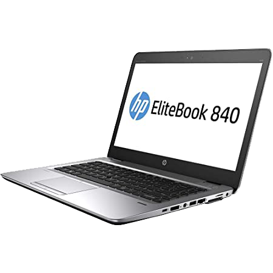

# OpenCore File and Config for my HP 840 G2

## READ THE ENTIRE README.md BEFORE YOU START

### I am not responsible for any damages you may cause

#### Status : **Work In Progress**

- Complete EFI packs are available in the [releases](https://github.com/kanggara75/Hackintosh-HP-840-G2-OpenCore/releases) page.
- I will try my best to keep the repo updated with the latest kexts and OpenCore version.
- Please **do not clone or download** from the main branch for daily use: it may include **unstable code** just because it is my repository. Use [Release](https://github.com/kanggara75/Hackintosh-HP-840-G2-OpenCore/releases) version
- This EFI is configured with Monterey.
- With every EFI update you retrieve from here please remember to go through the post install guide.

<strong> HARDWARE </strong>

 
  
> ## Spesifications
| Hardware           | Vendor | Device Name and Type              |
| :----------------- | ------ | --------------------------------- |
| CPU                | [Intel](http://www.intel.com/)  | [Intel® Core™ i5-5300U 2,3Ghz](https://ark.intel.com/content/www/us/en/ark/products/85213/intel-core-i55300u-processor-3m-cache-up-to-2-90-ghz.html)       |
| GPU                | [Intel](http://www.intel.com/)  | [Intel® HD Graphics 5500](https://ark.intel.com/content/www/us/en/ark/products/graphics/86210/intel-hd-graphics-5500.html)           |
| Wireless Conection | [Intel](http://www.intel.com/)  | [Intel® Dual Band Wireless-AC 8265](https://www.intel.com/content/www/us/en/products/sku/94150/intel-dual-band-wirelessac-8265/downloads.html) |
| Ethernet           | [Intel](http://www.intel.com/)  | [Intel® Ethernet I218-LM](https://ark.intel.com/content/www/us/en/ark/products/71307/intel-ethernet-connection-i218lm.html)           |

<strong> GETTING STARTED </strong>

 

Before you do anything, please familiarize yourself with basic Hackintosh terminologies and the basic Hackintosh process by throughly reading Dortania guides as linked in `REFERENCES`

- Creating a macOS installer: refer to [Dortania's OpenCore Install Guide](https://dortania.github.io/OpenCore-Install-Guide/installer-guide/)
- [**README-HARDWARE**](/Other/README_HARDWARE.md): Requirements before installing.
- [**README-OTHERS**](/Other/README_OTHERS.md): for post installation settings and other remarks.

<strong> REQUIREMENTS </strong>

 

- A macOS machine(optional): to create the macOS installer.
- Flash drive, 12GB or more, for the above purpose.
- Xcode works fine for editing plist files on macOS, but I prefer [PlistEdit Pro](https://www.fatcatsoftware.com/plisteditpro/).
- [ProperTree](https://github.com/corpnewt/ProperTree) if you need to edit plist files on Windows.
- [MaciASL](https://github.com/acidanthera/MaciASL), for patching ACPI tables and editing ACPI patches.
- [MountEFI](https://github.com/corpnewt/MountEFI) to quickly mount EFI partitions.
- [IORegistryExplorer](https://developer.apple.com/downloads), for diagnosis.
- [Hackintool](https://www.insanelymac.com/forum/topic/335018-hackintool-v286/), for diagnostic ONLY, Hackintool should not be used for patching, it is outdated.
- Patience and time, especially if this is your first time Hackintosh-ing.

<strong> SUMMARY </strong>

 

> ## Legend

| Legend | Status         |
| :----- | -------------- |
| ✅     | Work           |
| ❗     | Not Tested yet |
| ❌     | Not Work       |

> ### Non-Fuctional

| Feature            | Status | Dependency & Note                           |
| :----------------- | ------ | ------------------------------------------- |
| Fingerprint Reader | ❌     | `DISABLED` in BIOS to save power.           |
| Wireless WAN       | ❌     | `DISABLED` in BIOS to save power.           |
| Top Button         | ❌     | `Not Work` because i using Touchpad Gesture |

> ### Video and Audio

| Feature                              | Status | Dependency & Note                                                  |
| :----------------------------------- | ------ | ------------------------------------------------------------------ |
| Full Graphics Accleration (QE/CI)    | ✅     | `WhateverGreen.kext`                                               |
| Audio Recording                      | ✅     | `AppleALC.kext` with Layout ID = 4 and `SSDT-HPET.aml`             |
| Audio Playback                       | ✅     | `AppleALC.kext` with Layout ID = 4 and `SSDT-HPET.aml`             |
| Automatic Headphone Output Switching | ✅     | `AppleALC.kext` with Layout ID = 4 and `SSDT-HPET.aml`             |
| Dock Audio Port                      | ❗     | Not Tested, `AppleALC.kext` with Layout ID = 4 and `SSDT-HPET.aml` |
| VGA Port                             | ✅     | Testes on Projector                                                |
| HDMI Port                            | ❗     | Not Tested                                                         |

> ### Power, Charge, Sleep and Hibernation

| Feature                       | Status | Dependency & Note                                                                               |
| :---------------------------- | ------ | ----------------------------------------------------------------------------------------------- |
| Battery Percentage Indication | ✅     | `SMCBatteryManager.kext`                                                                        |
| Power Management              | ✅     | `CPUFriend.kext` and config with [CPUFriendFriend](https://github.com/corpnewt/CPUFriendFriend) |
| S3 Sleep/ Hibernation Mode 3  | ✅     | `SSDT-PWTK.aml`                                                                                 |

> ### Input/ Output

| Feature                       | Status | Dependency & Note             |
| :---------------------------- | ------ | ----------------------------- |
| WiFi                          | ✅     | `AirportItlwm.kext`           |
| Bluetooth                     | ✅     | `IntelBluetoothFirmware.kext` |
| Ethernet                      | ✅     | `IntelMausi.kext`             |
| USB 2.0, USB 3.0              | ✅     | `USBPorts.kext`               |
| USB Power Properties in macOS | ✅     | `SSDT-EC-USBX.aml`            |

> ### Display, TrackPad, TrackPoint, and Keyboard

| Feature                | Status | Dependency & Note                                                                                 |
| :--------------------- | ------ | ------------------------------------------------------------------------------------------------- |
| Brightness Adjustments | ✅     | `WhateverGreen.kext`, `SSDT-PNLF.aml` and `BrightnessKeys.kext`                                   |
| TrackPad               | ✅     | `VoodooPS2Controller.kext`                                                                        |
| Trackpad Gesture       | ✅     | [`VoodooRMI.kext`](https://github.com/VoodooSMBus/VoodooRMI#installation) with `VooDooSMBus.kext` |
| Built-in Keyboard      | ✅     | `VoodooPS2Controller.kext`                                                                        |

> ### macOS Continuity

| Feature                    | Status | Dependency & Note                     |
| :------------------------- | ------ | ------------------------------------- |
| iCloud, iMessage, FaceTime | ✅     | Whitelisted Apple ID, Valid SMBIOS    |
| AirDrop                    | ❗     | Not tested i don't have apple product |
| Time Machine               | ✅     | Native                                |

<strong> REFERENCES </strong>

 

Read these before you start:

- [dortania's Hackintosh guides](https://github.com/dortania).
- [dortania's OpenCore Install Guide](https://dortania.github.io/OpenCore-Install-Guide/).
- [dortania's OpenCore Post Install Guide](https://dortania.github.io/OpenCore-Post-Install/).
- [dortania/ Getting Started with ACPI](https://dortania.github.io/Getting-Started-With-ACPI/).
- [dortania/ opencore `multiboot`](https://github.com/dortania/OpenCore-Multiboot).
- [dortania/ `USB map` guide](https://dortania.github.io/OpenCore-Post-Install/usb/).
- [WhateverGreen Intel HD Manual](https://github.com/acidanthera/WhateverGreen/blob/master/Manual/FAQ.IntelHD.en.md).
- `Configuration.pdf` and `Differences.pdf` in each `OpenCore` releases.

<strong> CREDITS </strong>

 

- [Apple](https://www.apple.com) for macOS.
- [Acidanthera](https://github.com/acidanthera) for all the kexts/utilities that they made.
- [Dortania](https://github.com/dortania) for for the OpenCore Install Guide.
- [Rehabman](https://github.com/RehabMan) for the patches and guides and kexts.

